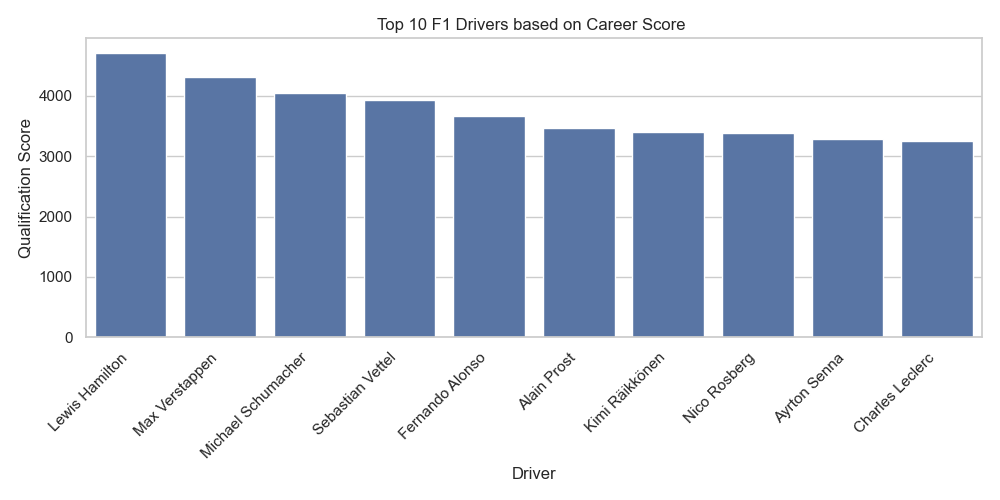
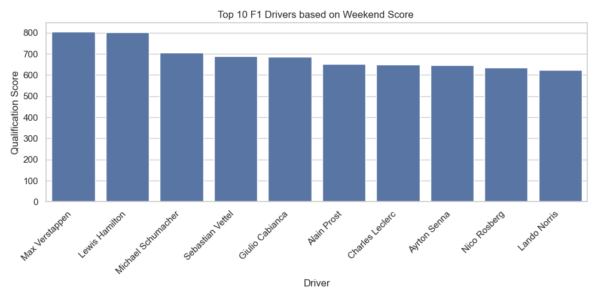
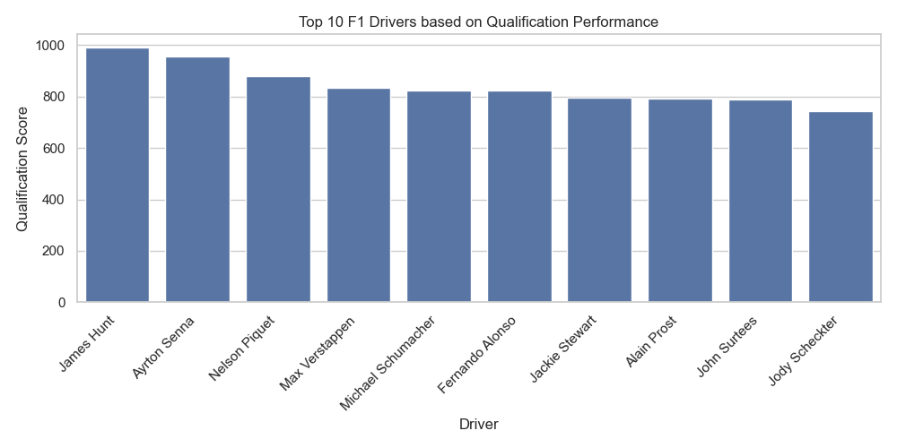

# **Who is the Greatest F1 Driver of All Time?**

One of my favourite things about having the skills I do is being able to apply them wherever I like, for whatever use I want. In this instance, an innocent conversation between friends has turned into using data analytics tools to produce a definite result. 

I used a range of performance metrics, both custom and pre-defined to measure performance of drivers from the 1960 season all the way up to modern day, the 2024 season.

The analysis is powered by a **custom, comprehensive dataset**, meticulously scraped and cleaned from race archives. No pre-made datasets were used, ensuring the data is complete, accurate, and tailored for this project. The dataset can be found at : ______ .

---

## **Project Overview**

Formula 1 is a sport of immense complexity, where success depends not only on driver skill but also on team dynamics, car performance, and the competitive landscape. This project leverages historical F1 data to compare drivers using the wide variety of metrics as detailed below:

- Average Race Position.
- Average Qualifying Position.
- Average FP1, FP2 and FP3 Positions.
- Average Fastest Lap Race Rank.
- Average Number of Places Lost/Gained in Races.
- Average Number of Places Above/Below Teammate in Race.
- Average Number of Places Above/Below Teammate in Qualification.
- Average Driver Standings Position.
- Average Constructor Standings Position.
- Win Percentage.
- Number of Races Normalisation.

Custom Scores I Defined Were:

- Weekend Score
- Career Score

The custom dataset includes detailed information from every race since Formula 1 began in 1950, including qualifying, race results and contextual data such as weather and circuit characteristics.

---

## **Features**

- **Teammate Comparisons**: Assessing how drivers performed relative to their teammates.
- **Competitive Context Analysis**: Evaluating performance relative to other drivers on the grid.
- **Team Performance Adjustments**: Accounting for car performance differences across seasons.
- **Era Normalization**: Normalizing metrics to compare drivers from different eras.
- **Custom Visualizations**: Providing compelling visual insights into driver dominance and consistency.

---

## **Data Sources**

This project is built entirely on a **custom dataset** created by scraping data from official Formula 1 sources, historical race archives, and other publicly available records. The dataset includes:

- Detailed race results for every season since 1950.
- Qualifying and lap-by-lap data.
- Teammate and team performance metrics.
- Contextual data like weather, circuit characteristics, and car specifications.

All data was scraped, cleaned, and processed into a unified format specifically for this analysis.

---

## **Methodology**

1. **Data Collection and Preprocessing**  
   - Scraping data from official Formula 1 race archives and public resources.
   - Cleaning and transforming raw HTML tables, PDFs, and other formats into structured datasets.

2. **Feature Engineering**  
   - Calculating performance metrics such as win percentage, qualifying gaps, and points per race.
   - Creating teammate comparison metrics and car performance indices.

3. **Modeling and Analysis**  
   - Statistical modeling to evaluate driver skill independently of car performance.
   - Comparing drivers within the same team and across different teams.
   - Clustering drivers by era and normalizing performance data.

4. **Visualization**  
   - Building visualizations to showcase trends and performance highlights.
   - Generating driver ranking charts and heatmaps.

---

## **Results**

The analysis yielded several key insights into the performance of Formula 1 drivers across different eras. Below are some of the visualizations generated from the data:

#### **Driver Performance Over Career**

#### **Driver Performance On Any Given Weekend**

#### **Driver Performance in Race Only**

#### **Driver Performance in Qualifying Only**

